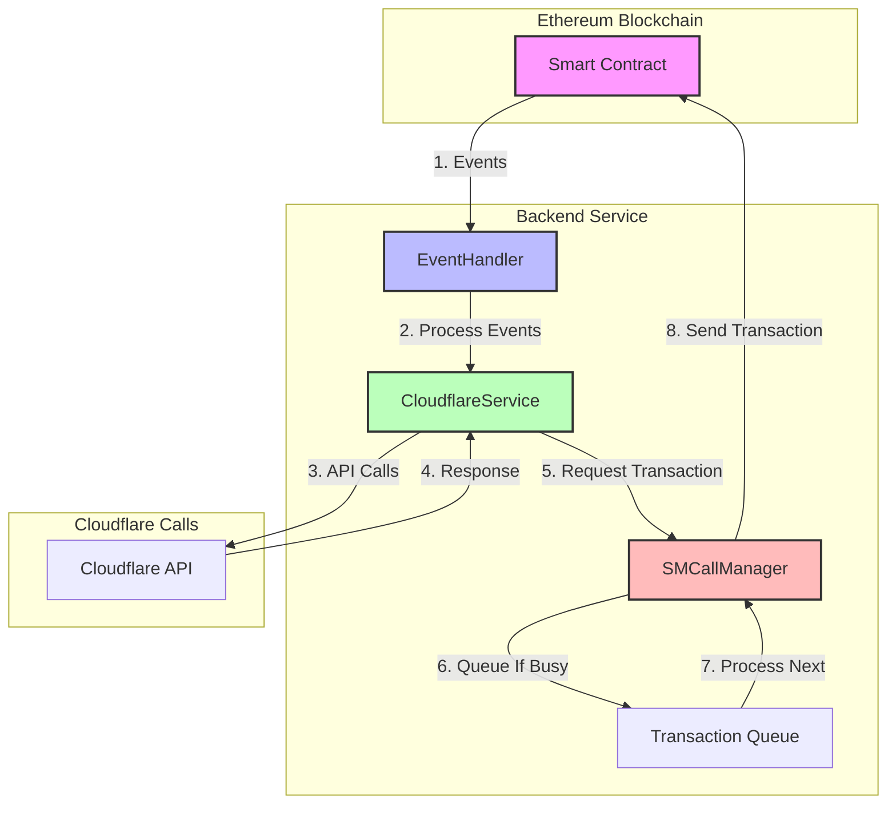
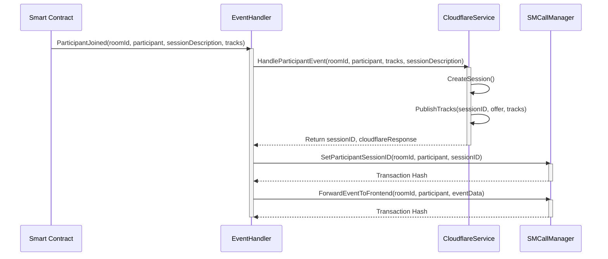
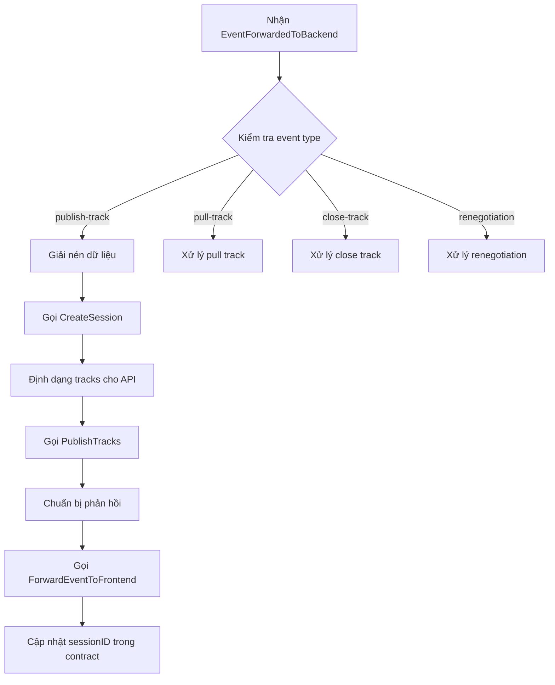
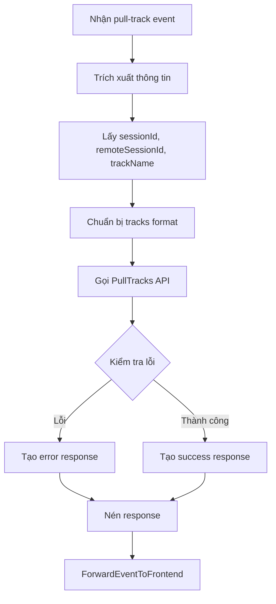
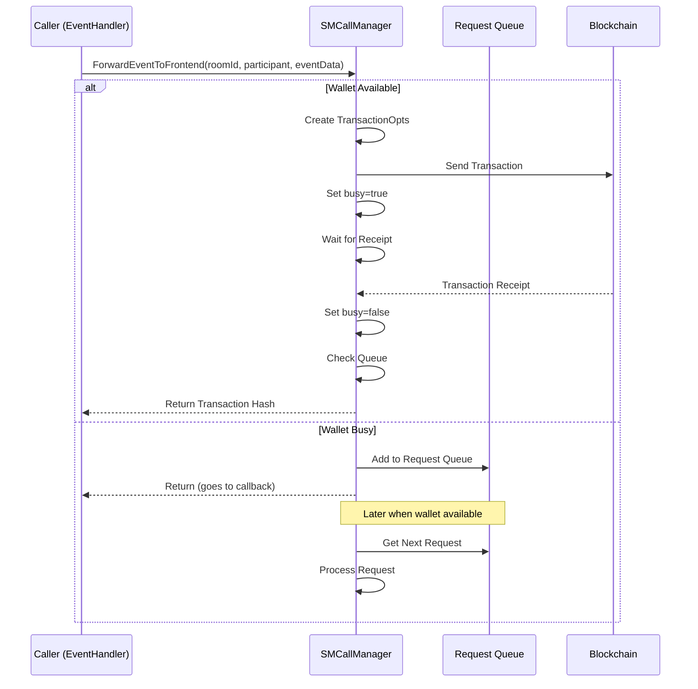
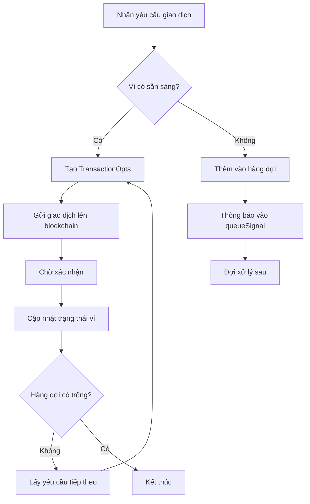
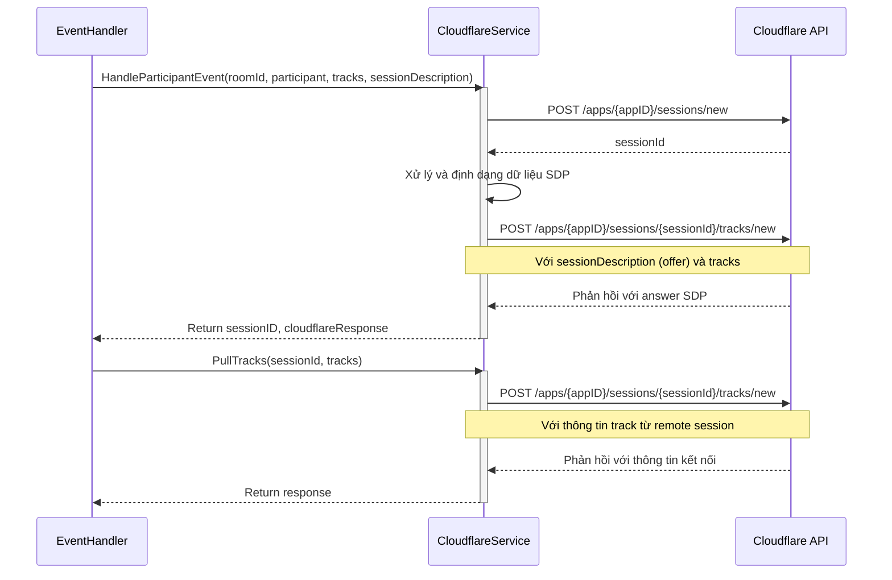
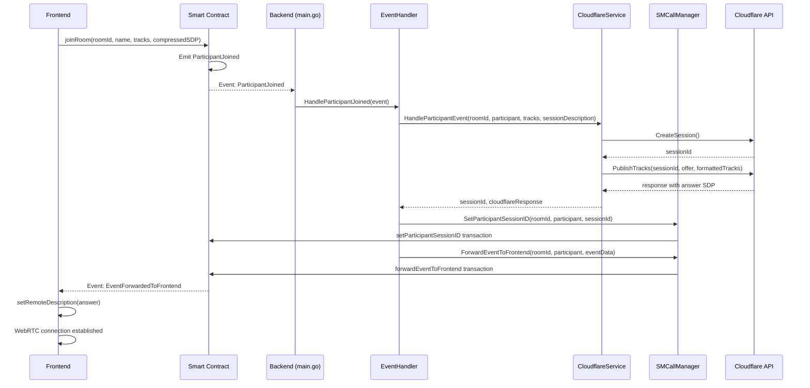
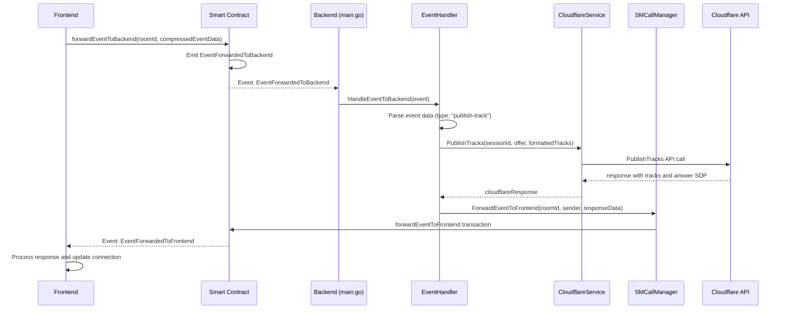

# Backend cho DApp Meeting

## Điểm chính của hệ thống

- Backend của DApp Meeting được viết bằng **Go** và có ba thành phần chính:
  1. **EventHandler**: Xử lý các sự kiện từ smart contract và điều phối luồng xử lý
  2. **SMCallManager**: Quản lý giao dịch blockchain với hàng đợi và xử lý đồng bộ
  3. **CloudflareService**: Tương tác với API Cloudflare Calls để quản lý kết nối WebRTC

- Hệ thống sử dụng mô hình **lắng nghe sự kiện** từ blockchain và **đáp ứng theo luồng sự kiện**, tạo nên một kiến trúc phi tập trung:
  ```
  Smart Contract ─(Event)─> EventHandler ─> CloudflareService ─> SMCallManager ─(Transaction)─> Smart Contract
  ```

- Backend sử dụng **mô hình hàng đợi** cho các giao dịch blockchain và xử lý chúng tuần tự để tránh xung đột nonce và đảm bảo tính nhất quán.

- Hệ thống làm việc với **Cloudflare Calls API** để quản lý session WebRTC, xuất bản (publish) và kéo (pull) các track media giữa các người tham gia.

---

## Kiến trúc hệ thống

### Sơ đồ tổng quan



### Thành phần chính

Backend được thiết kế với kiến trúc hướng sự kiện (event-driven) và gồm ba module chính, phản ánh chính xác cấu trúc code hiện tại:

1. **EventHandler** (`handle/EventHandler.go`):
   - Lắng nghe các sự kiện từ smart contract (`ParticipantJoined`, `ParticipantLeft`, `TrackAdded`, `EventForwardedToBackend`)
   - Điều phối xử lý sự kiện đến các module liên quan
   - Phân tích và xử lý dữ liệu từ các sự kiện, phản hồi lại cho frontend

2. **SMCallManager** (`handle/SMCall.go`):
   - Quản lý các giao dịch blockchain với một ví private
   - Thực hiện hàng đợi giao dịch để tránh xung đột nonce
   - Đảm bảo giao dịch được thực hiện tuần tự và đáng tin cậy
   - Xác nhận giao dịch hoàn thành trước khi xử lý yêu cầu tiếp theo

3. **CloudflareService** (`handle/cloudflareService.go`):
   - Tương tác với API Cloudflare Calls 
   - Quản lý các phiên WebRTC với các hàm chính: `CreateSession`, `PublishTracks`, `PullTracks`
   - Xử lý nén/giải nén dữ liệu SDP trao đổi với frontend
   - Kết nối và định tuyến các track media giữa các phiên

## Chi tiết hoạt động của EventHandler

EventHandler là thành phần trung tâm của backend, điều phối mọi hoạt động xử lý sự kiện.

### Sơ đồ hoạt động



### Chi tiết xử lý sự kiện

EventHandler (trong `handle/EventHandler.go`) lắng nghe và xử lý bốn loại sự kiện chính từ smart contract:

1. **ParticipantJoined**: Xử lý khi người dùng tham gia phòng họp
   - Nhận thông tin: roomId, địa chỉ participant, sessionDescription, và danh sách track ban đầu
   - Gọi CloudflareService để tạo phiên và publish track ban đầu
   - Cập nhật sessionID cho người tham gia trong smart contract thông qua SMCallManager
   - Gửi sự kiện với thông tin phản hồi về frontend qua ForwardEventToFrontend

2. **ParticipantLeft**: Xử lý khi người dùng rời phòng họp
   - Ghi log và xử lý tài nguyên liên quan (nếu cần)

3. **TrackAdded**: Xử lý khi có track mới được thêm vào
   - Cập nhật thông tin track trong hệ thống

4. **EventForwardedToBackend**: Xử lý các yêu cầu từ frontend
   - Phân tích eventData để xác định loại yêu cầu (publish-track, pull-track, close-track, renegotiation)
   - Xử lý tương ứng với từng loại yêu cầu
   - Gửi kết quả xử lý về frontend thông qua ForwardEventToFrontend

### Xử lý yêu cầu publish track



### Xử lý yêu cầu pull track



## Chi tiết hoạt động của SMCallManager

SMCallManager (trong `handle/SMCall.go`) quản lý các giao dịch với smart contract một cách tuần tự và đáng tin cậy, sử dụng cơ chế hàng đợi.

### Sơ đồ cơ chế hàng đợi giao dịch



### Cấu trúc và hoạt động

1. **Mô hình quản lý giao dịch**:
   - Sử dụng **một private key duy nhất** từ biến môi trường để thực hiện tất cả giao dịch
   - Quản lý trạng thái bận/rảnh với biến `busy` được bảo vệ bởi mutex
   - Khi ví bận, các yêu cầu mới được đưa vào hàng đợi đợi xử lý sau

2. **Cấu trúc hàng đợi yêu cầu**:
   - Mỗi yêu cầu giao dịch là một struct `TransactionRequest` chứa:
     ```go
     type TransactionRequest struct {
         Method       string          // Tên phương thức cần gọi
         RoomID       string          // ID phòng họp
         Participant  common.Address  // Địa chỉ người tham gia 
         SessionID    string          // Session ID (nếu liên quan)
         EventData    []byte          // Dữ liệu sự kiện
         ResponseChan chan *TransactionResponse // Kênh phản hồi
     }
     ```
   - Hàng đợi được thực hiện bằng slice: `requestQueue []TransactionRequest`
   - Sử dụng channel `queueSignal` để thông báo về yêu cầu mới

3. **Các phương thức chính**:
   - `ForwardEventToFrontend(roomId, participant, eventData)`: Gửi sự kiện đến frontend
   - `SetParticipantSessionID(roomId, participant, sessionID)`: Cập nhật session ID
   - `AddNewTrackAfterPublish(roomId, participant, sessionID, trackName, mid, location, isPublished)`: Cập nhật thông tin track mới sau khi publish

4. **Xử lý hàng đợi**:
   - Goroutine `processQueue` chạy liên tục để theo dõi tín hiệu từ `queueSignal`
   - `processNextRequest` xử lý yêu cầu tiếp theo khi ví sẵn sàng
   - Sau khi hoàn thành mỗi giao dịch, hệ thống kiểm tra hàng đợi và tiếp tục xử lý nếu còn yêu cầu

5. **Xác nhận giao dịch**:
   - Sử dụng `waitForReceipt` để chờ xác nhận giao dịch hoàn thành
   - Kiểm tra trạng thái giao dịch từ receipt để đảm bảo thành công

### Luồng xử lý giao dịch



## Chi tiết hoạt động của CloudflareService

CloudflareService (trong `handle/cloudflareService.go`) quản lý tất cả tương tác với API Cloudflare Calls WebRTC, đóng vai trò trung gian kết nối giữa những người tham gia phòng họp.

### Sơ đồ tương tác với Cloudflare API



### Cấu trúc và chức năng chính

1. **Khởi tạo và cấu hình**:
   - Sử dụng tham số `baseURL`, `appID`, và `appSecret` để xác thực với Cloudflare API
   - Cấu hình HTTP client cho các yêu cầu API

2. **Chức năng chính**:
   - `CreateSession()`: Tạo phiên WebRTC mới trên Cloudflare và trả về ID phiên
   - `PublishTracks(sessionID, offer, tracks)`: Publish tracks vào phiên với thông tin SDP offer
   - `PullTracks(sessionID, tracks)`: Kéo tracks từ một phiên remote vào phiên hiện tại
   - `Renegotiate(sessionID, sessionDescription)`: Thương lượng lại kết nối WebRTC
   - `CloseTracks(sessionID, tracks, force, sessionDescription)`: Đóng tracks trong phiên
   - `GetSessionState(sessionID)`: Lấy thông tin trạng thái hiện tại của phiên

3. **Xử lý dữ liệu SDP**:
   - `decompressZlib(compressedB64)`: Giải nén dữ liệu SDP được mã hóa base64+zlib
   - `decompressData(data)`: Hàm giải nén đa năng, hỗ trợ nhiều định dạng nén
   - Xử lý linh hoạt các dữ liệu nén từ frontend trong nhiều định dạng khác nhau

4. **Tương tác đầy đủ với Cloudflare**:
   - `HandleParticipantEvent(roomID, participant, tracks, sessionDescription)`: Xử lý đầy đủ một sự kiện người dùng tham gia
   - Tự động tạo phiên, định dạng dữ liệu, và publish tracks

### Quy trình giải nén dữ liệu SDP

```mermaid
flowchart TD
    A[Nhận dữ liệu từ smart contract] --> B{Kiểm tra định dạng}    B -->|"Bắt đầu với 'zlib:'"| C[Trích xuất phần base64]
    C --> D[Giải mã base64]
    D --> E[Giải nén zlib]
    E --> I[Trả về dữ liệu giải nén]
    
    B -->|"Dữ liệu zlib trực tiếp"| F[Tạo zlib reader]
    F --> G[Đọc dữ liệu]
    G --> I
    
    B -->|"Dữ liệu JSON"| H[Kiểm tra trường compressedData]
    H --> C
    
    B -->|"Định dạng khác"| J[Trả về nguyên bản]
```
    B -->|Dữ liệu bytes| F[Thử giải nén trực tiếp với zlib]
    F -->|Thành công| G[Trả về dữ liệu giải nén]
    F -->|Thất bại| H[Thử parse JSON]
    H -->|Thành công và có compressedData| I[Trích xuất và giải nén]
    H -->|Không thể parse| J[Trả về nguyên dạng]
    E --> K[Trả về dữ liệu giải nén]
    I --> K
```

## Luồng xử lý hoàn chỉnh

### Luồng xử lý khi người dùng tham gia phòng



### Luồng xử lý khi người dùng publish track mới



#### Luồng Xử Lý  
1. **Người tham gia gia nhập phòng**:  
   - Smart contract phát "ParticipantJoined" (room ID, địa chỉ ví, sessionDescription).  
   - Phần 1 lắng nghe, gọi `getParticipantInfo` để lấy danh sách track, rồi gọi Phần 2 với dữ liệu.  

2. **Phần 2 xử lý với Cloudflare**:  
   - Tạo session, publish track, nhận phản hồi.  
   - Chuẩn bị dữ liệu sự kiện (session ID, phản hồi Cloudflare), yêu cầu Phần 1 gọi `forwardEventToFrontEnd`.  

3. **Phần 1 quản lý giao dịch**:  
   - Chọn ví trống, gửi giao dịch, nếu bận thì xếp hàng đợi, đảm bảo mỗi ví chỉ xử lý một giao dịch tại một thời điểm.  

#### Ví Dụ Triển Khai  
- Người tham gia gọi `joinRoom`, smart contract phát "ParticipantJoined" với room ID, địa chỉ ví, và sessionDescription.  
- Phần 1 lấy track từ `getParticipantInfo`, gọi Phần 2 với dữ liệu.  
- Phần 2 tạo session ID "session123", publish track, nhận phản hồi, rồi yêu cầu Phần 1 gọi `forwardEventToFrontEnd` với dữ liệu:  
  - `{"sessionID": "session123", "type": "join-room","cloudflareResponse": {"answer": "someAnswer"}}`.  
- Phần 1 chọn ví trống, gửi giao dịch, frontend nhận sự kiện và cập nhật với session ID và phản hồi.  

#### Bảng Tổng Hợp  
| Thành phần          | Chức năng                                      | Công việc chính                                      | Giao tiếp với khác       |
|---------------------|-----------------------------------------------|-----------------------------------------------------|--------------------------|
| Phần 1 (EventListener) | Lắng nghe sự kiện, quản lý ví, gửi giao dịch | Kết nối blockchain, lấy track, chọn ví, xếp hàng đợi | Gọi Phần 2, xử lý Phần 2 |
| Phần 2 (CloudflareHandler) | Tương tác Cloudflare, gửi sự kiện về frontend | Tạo session, publish track, chuẩn bị dữ liệu sự kiện | Yêu cầu Phần 1 gửi giao dịch |

---
